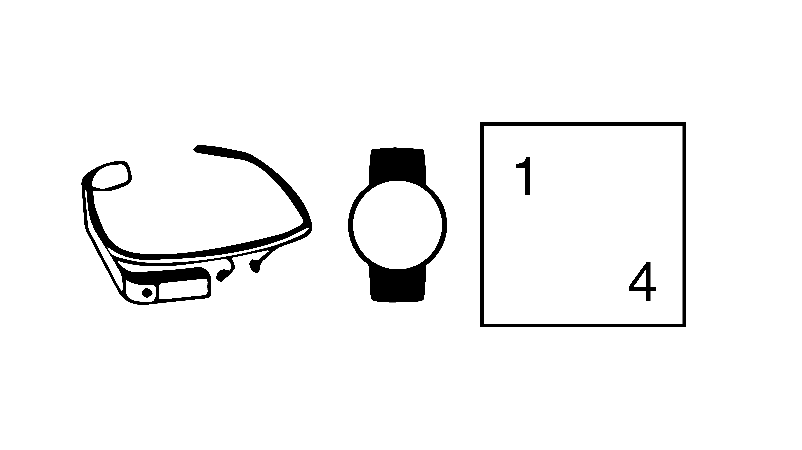

# HUD vs. Watch

Android application (Mobile, HUD, Watch) for HUD vs. Watch dual-task study



## Setup

### Cloning and building Code

```shell
git clone https://github.com/Dual-Task/HUDvsWatch.git
cd HUDvsWatch
cd src
# Open src directory in Android Studio
open -a "Android Studio" .
```

Hit build in the IDE and deploy to your mobile devices.

### Setting up watch for deployment

Instructions for setting up a WearOS device for mobile (Bluetooth or WiFi) debugging can be found [here](https://developer.android.com/training/wearables/apps/debugging.html):

```shell
adb forward tcp:4444 localabstract:/adb-hub
adb connect 127.0.0.1:4444
```

Following the above instructions will allow you wirelessly to deploy from Android Studio onto your smartwatch.
